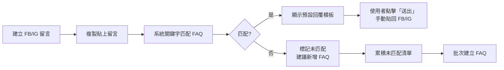
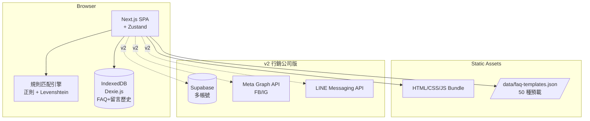
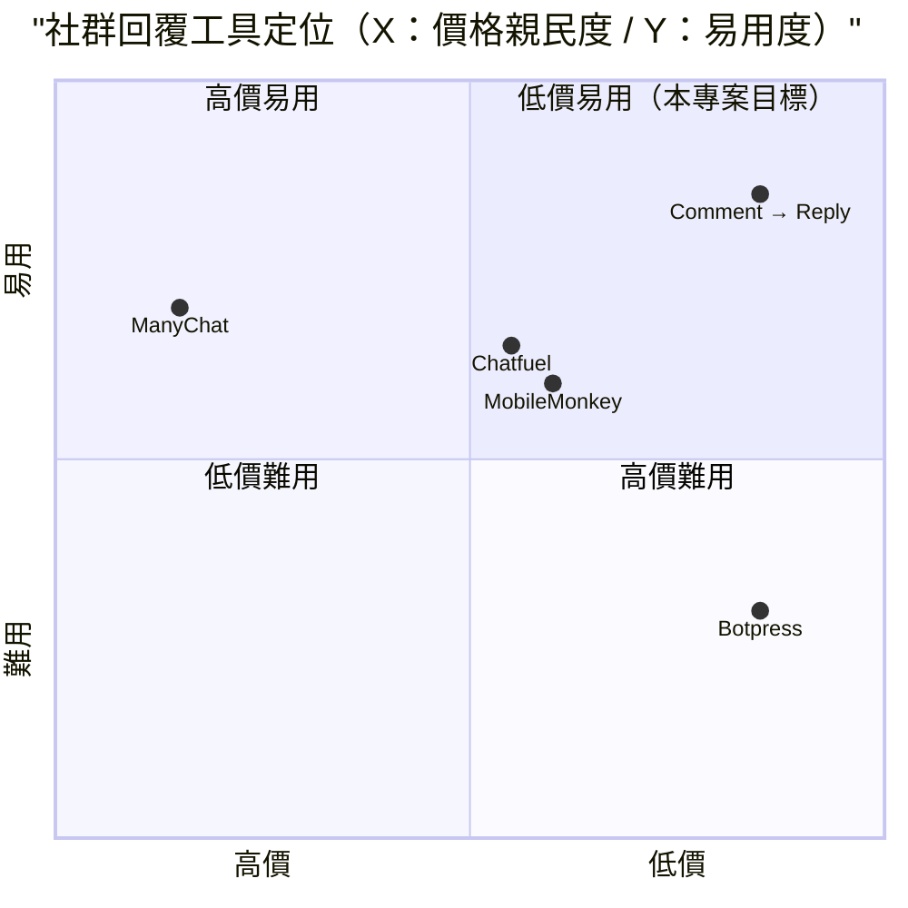

# 社群留言自動回覆系統 — 規格計劃書 v2.2.1

> 版本：v2.2.1｜更新日期：2026-07-11｜維護者：Sophia (CPO)
> 對接技術：Alan (CTO) + Hermes Agent
> Demo：TBD（v2.2.1 規格階段，待 Sprint 1 部署）
> 原始碼：https://github.com/openclawsean024-create/social-comment-auto-reply

---

## 1. 產品概述 (Product Overview)

### 1.1 問題陳述 (Problem Statement)

小編 / 社群經營者 / KOL / 微型店家每天回 FB / IG / LINE 留言耗時 2-3 小時，常見問題重複回答，留言量大時易漏回影響互動率：

1. **手動回覆成本高**：每天 2-3 小時 × 30 天 = 60-90 小時/月（每小時 NT$150 計算 = 月薪資成本 NT$9,000-13,500）
2. **商用 chatbot 平台貴**：ManyChat 月費 US$15-145、Chatfuel US$15/月，設定複雜無台灣在地化
3. **既有 chatbot 平台複雜**：學習曲線高，多為歐美在地化、不支援繁體中文友善
4. **留言量大易漏回**：KOL / 自媒體每天 100+ 則留言，手動回不完

**目標使用者**：
- 小編 / 社群經營者：每天回 FB / IG / LINE 留言耗 2-3 小時、常見問題重複回答
- KOL / 自媒體：留言量爆炸、易漏回、影響互動率
- 微型店家（FB 粉專）：客服需求但無客服預算
- 行銷公司：客戶多帳號管理、人力成本高

### 1.2 目標使用者 (User Personas)

| Persona | 規模 | 核心痛點 | 願付價格 |
|---|---|---|---|
| **小編 / 社群經營者（小芳）** | 10 萬 | 每天回留言耗 2-3 小時 | NT$199/月 |
| **KOL / 自媒體（小凱）** | 5 萬 | 留言量大、易漏回 | NT$299/月 |
| **微型店家（阿明）** | 5 萬 | 客服需求無預算 | NT$199/月 |
| **行銷公司（Lisa）** | 3,000 | 客戶多帳號管理 | NT$1,499/月 |

### 1.3 核心價值主張 (Value Proposition)

> 「**規則式自動回覆（關鍵字 + 模板）+ 純前端 + 零月費 + 繁中友善**。常見 FAQ 自動處理 80% 留言，省下每天 2-3 小時。」

**三大差異化**：
1. **規則式（不是 AI）**：可解釋、可控制，無 GPT hallucination 風險
2. **零月費零商用 API**：完全 self-hosted 純前端，不依賴 OpenAI
3. **繁中友善**：預載 50 種常見問題模板（價格 / 營業時間 / 退換貨 等）

### 1.4 商業目標 (KPIs / OKRs)

| 時間 | KPI | 目標值 |
|---|---|---|
| **3 個月** | 註冊用戶 | 2,000 |
| **6 個月** | 付費轉化率 | 5%（100 付費） |
| **6 個月** | MRR | NT$30,000 |
| **12 個月** | MRR | NT$200,000 |
| **12 個月** | 月處理留言 | 50 萬則 |

### 1.5 Non-Goals (明確不做)

- ❌ **不做 AI 自動回覆**（GPT-4o）— hallucination 風險高，規則式更可控
- ❌ **不做影片 / 圖片留言回覆** — v3+ 評估
- ❌ **不串接 Messenger API 自動化** — v2 才加（v1 為「半自動」貼上模板）
- ❌ **不做 IG DM 自動回覆** — IG ToS 禁止自動化，v1 不做
- ❌ **不做跨平台收件匣** — v2 + 統一收件匣
- ❌ **不做 AI 語氣模擬** — 規則式語氣穩定可控制

---

## 2. 使用者場景與流程

### 2.1 使用者流程圖



### 2.2 關鍵用戶故事 (User Stories)

**US-001：留言貼上 + 自動匹配**
> As a 小編  
> I want to 把 FB 留言複製貼上，系統自動匹配預載 FAQ 顯示回覆模板  
> So that 我不用手動想，30 秒內送出回覆

**US-002：FAQ 規則 CRUD**
> As a 小編  
> I want to 預載 50 種常見 FAQ（價格 / 營業時間 / 退換貨 等）+ 自訂 FAQ  
> So that 80% 常見問題自動處理

**US-003：未匹配建議**
> As a 小編  
> When 系統偵測到「未匹配留言」  
> Then 自動建議「建議新增 FAQ：OOO」

**US-004：多帳號管理**
> As a 行銷公司  
> I want to 一個工具管理 5-20 個客戶粉專帳號，各自獨立 FAQ 庫  
> So that 我不用切換 5 個工具

**US-005：回覆歷史 + 報表**
> As a 小編  
> I want to 月底看見「本月處理 500 則留言 / 自動回覆 80% / 平均回覆時間 30 秒」  
> So that 我能向主管展示效益

**US-006：Messenger API 直接回覆**（v2）
> As a KOL  
> I want to 連結 FB / IG 帳號後，自動收到留言 + 自動回覆  
> So that 我不用每天手動處理

### 2.3 邊界場景 (Edge Cases)

- **留言含 emoji**：關鍵字匹配需考慮 emoji
- **留言含圖片**：標記為「需人工處理」+ 跳過自動回覆
- **留言含個資**：自動偵測（電話 / Email）+ 提示使用者注意
- **多語言留言**：支援繁中 + 英文（其他語言標記人工處理）

---

## 3. 功能性需求 (Functional Requirements)

### 3.1 MVP（必做，P0）

- [ ] **F-001 留言貼上 + 自動匹配**（Given 留言文字，When 點擊匹配，Then 顯示匹配 FAQ + 回覆模板）
- [ ] **F-002 50 種預載 FAQ**（價格 / 營業時間 / 退換貨 / 客服聯繫 / 配送 等）
- [ ] **F-003 FAQ 規則 CRUD**（關鍵字 + 答案 + 平台來源）
- [ ] **F-004 一鍵複製回覆**（匹配後一鍵複製回覆到剪貼簿）
- [ ] **F-005 未匹配建議**（未匹配留言自動建議「新增 FAQ」）
- [ ] **F-006 多帳號管理**（v2 預先實作框架，單帳號主流程）
- [ ] **F-007 留言歷史**（IndexedDB 儲存最近 100 則留言）
- [ ] **F-008 效益報表**（回覆數 / 自動率 / 平均時間）
- [ ] **F-009 JSON 匯出匯入**（FAQ + 留言歷史備份）
- [ ] **F-010 RWD 三斷點**（375/768/1440px）

### 3.2 v2.0 行銷公司版（加值，P1）

- [ ] **F-011 Messenger API 自動收發**（Meta Graph API）
- [ ] **F-012 LINE 官方帳號 API 整合**
- [ ] **F-013 多帳號管理 5-20 帳號**
- [ ] **F-114 AI 語氣微調**（人工覆寫 + AI 潤稿）
- [ ] **F-115 跨平台統一收件匣**（FB + IG + LINE）
- [ ] **F-116 客戶（品牌）管理**（代理商管理 5-50 個品牌）

### 3.3 v3.0（願景，P2）

- [ ] **F-017 GPT-4o 自動回覆**（明確允許的情境下）
- [ ] **F-018 影片 / 圖片留言回覆**
- [ ] **F-019 情緒分析**（負面留言升級人工）
- [ ] **F-020 競品監控**（跨帳號關鍵字監控）

### 3.4 Acceptance Criteria (Given/When/Then)

**AC-001（留言貼上 + 自動匹配）**
> Given 留言「請問價格？」  
> When 點擊「匹配」  
> Then 顯示「FAQ #1：價格」+ 答案「我們的價格為 NT$499 起」

**AC-002（50 預載 FAQ）**
> Given 首次進入  
> When 載入 FAQ 庫  
> Then 顯示 50 條預載 FAQ（價格 / 營業時間 / 退換貨 / 客服聯繫 / 配送 等）

**AC-003（FAQ CRUD）**
> Given 已有 50 條 FAQ  
> When 新增 FAQ「關鍵字=發票, 答案=請留 email」  
> Then FAQ 庫增加 1 條，後續留言含「發票」自動匹配

**AC-004（一鍵複製）**
> Given 已匹配 FAQ  
> When 點擊「複製」  
> Then 剪貼簿含完整回覆模板（一鍵到 FB / IG 貼上）

**AC-005（未匹配建議）**
> Given 留言「請問保固多久？」未匹配任何 FAQ  
> When 點擊匹配  
> Then 顯示「未匹配，建議新增 FAQ『保固』」

**AC-006（留言歷史）**
> Given 已處理 50 則留言  
> When 開啟歷史  
> Then 顯示 50 則留言列表（含原文 + 匹配的 FAQ + 回覆時間）

**AC-007（效益報表）**
> Given 30 天留言 500 則  
> When 開啟報表  
> Then 顯示「本月 500 則 / 自動回覆 80% / 平均 30 秒 / 最熱 FAQ 前 5」

**AC-008（多語言）**
> Given 留言含中文 + 英文混合  
> When 點擊匹配  
> Then 同時顯示中英文 FAQ 結果（如有）

**AC-009（JSON 匯出匯入）**
> Given 已有 50 FAQ + 100 留言歷史  
> When 點擊匯出  
> Then 下載 `comment-reply-backup-2026-07-11.json`

**AC-010（含圖片留言）**
> Given 留言含圖片（純文字版：圖片 ID）  
> When 點擊匹配  
> Then 標記「含圖片，需人工處理」+ 跳過自動回覆

---

## 4. 系統設計 (System Design)

### 4.1 技術棧 (Tech Stack)

| 層 | 技術 | 理由 |
|---|---|---|
| 前端 | Next.js 14 (App Router) + React 18 + TypeScript | 與既有專案一致 |
| 樣式 | Tailwind CSS 3 | 快速 RWD |
| 規則匹配 | 正則表達式 + Levenshtein distance | 純前端、可解釋 |
| 狀態管理 | Zustand | 輕量 |
| 資料持久化 | IndexedDB（Dexie.js） | FAQ + 留言歷史 |
| 部署 | Vercel | 與既有 91 個專案一致 |
| B2B 後端 | Supabase（v2 多帳號） | 多客戶管理 |
| API 整合 | Meta Graph API（v2）+ LINE Messaging API（v2） | 自動收發 |

### 4.2 系統架構圖 (Mermaid)



### 4.3 資料模型 (Prisma schema)

```prisma
// IndexedDB schema (Prisma 對照版)
model FAQ {
  id          String   @id @default(uuid())
  accountId   String?  // v2 多帳號
  account     Account? @relation(fields: [accountId], references: [id])
  keywords    String[] // 觸發關鍵字（多個 OR）
  question    String   @db.Text // FAQ 問題
  answer      String   @db.Text // 預設答案
  platform    String   @default("all") // fb / ig / line / all
  language    String   @default("zh-TW")
  matchCount  Int      @default(0)
  isActive    Boolean  @default(true)
  isTemplate  Boolean  @default(false)
  createdAt   DateTime @default(now())
  
  @@index([accountId])
}

model CommentLog {
  id          String   @id @default(uuid())
  accountId   String?  // v2
  account     Account? @relation(fields: [accountId], references: [id])
  commenterName String
  commentText String   @db.Text
  platform    String   // fb / ig / line
  faqId       String?
  faq         FAQ?     @relation(fields: [faqId], references: [id])
  replyText   String?  @db.Text
  wasMatched  Boolean  @default(false)
  replyTime   Int?     // 秒（從留言到回覆）
  createdAt   DateTime @default(now())
  
  @@index([accountId, createdAt])
}

model Account {
  id          String   @id @default(uuid()) // v2 多帳號
  userId      String?  // v2
  platform    String   // fb / ig / line
  accountName String   // 粉專名稱
  accessToken String?  // v2 加密
  isActive    Boolean  @default(true)
  faqs        FAQ[]
  comments    CommentLog[]
  createdAt   DateTime @default(now())
}

model UnmatchedSuggestion {
  id          String   @id @default(uuid()) // 未匹配建議
  accountId   String?
  suggestedKeyword String
  suggestedAnswer String?
  originalComment String  @db.Text
  frequency   Int      @default(1)
  status      String   @default("pending") // pending / faq_created / dismissed
  createdAt   DateTime @default(now())
}

model User {
  id        String   @id @default(uuid())
  email     String?  @unique
  accounts  Account[]
}
```

### 4.4 API 規格 (REST endpoints)

| Method | Path | Auth | 用途 |
|---|---|---|---|
| GET | /data/faq-templates.json | Optional | 50 條預載 FAQ |
| POST | /api/export/snapshot | Optional | JSON 匯出 |
| POST | /api/import/snapshot | Optional | JSON 匯入 |
| POST | /api/facebook/webhook | Required | v2 Meta Graph webhook |
| POST | /api/line/webhook | Required | v2 LINE webhook |
| POST | /api/comments/auto-reply | Required | v2 自動回覆 API |
| POST | /api/stripe/checkout | Required | v2 Stripe 訂閱 |
| POST | /api/stripe/webhook | Required | v2 Stripe webhook |

---

## 5. 非功能性需求 (Non-Functional Requirements)

### 5.1 性能指標

| 指標 | 目標 |
|---|---|
| 主頁載入 P95 | ≤ 2 秒 |
| 留言匹配時間 | 即時（<200ms） |
| 100 留言歷史搜尋 | ≤ 500ms |
| 報表生成 | ≤ 2 秒 |
| 自動回覆（v2） | ≤ 5 秒 |
| 並發用戶 | 500 |
| 月活躍用戶 | 2,000 |

### 5.2 安全與隱私

- **OAuth token 加密**：AES-256-GCM（v2 多帳號）
- **個資最小化**：留言原文存儲，user agent 不外洩
- **HTTPS 強制**：Vercel 自動 + HSTS
- **無個資收集**：v1 純前端，v2 才加 Supabase Auth
- **客服資料保護**：IndexedDB 加密

### 5.3 降級機制 (Graceful Degradation)

| 失敗服務 | 掛掉情境 | 降級行為（切換到）| 用戶感受 |
|---|---|---|---|
| IndexedDB 損壞 | 版本衝突 掛掉 | 切換到 localStorage（容量小） | 部分留言歷史可能遺失 |
| Levenshtein 匹配過寬 | 誤判高 掛掉 | 切換到純正則表達式匹配 | 召回率下降 |
| 預載 FAQ 缺失 | JSON 損壞 掛掉 | 切換到內嵌 hardcode 預設 FAQ | 預載 FAQ 為備援 |
| Meta Graph API v2 | 5xx / token 過期 掛掉 | 切換到手動模式（貼上留言） | v2 自動失效 |
| LINE Messaging API v2 | 5xx 掛掉 | fallback Email 通知 | 通知通道切換 |
| Supabase v2 | DB 5xx 掛掉 | 切換到 Vercel KV 唯讀模式 | 多帳號同步暫停 |
| Stripe webhook v2 | Webhook 5xx 掛掉 | 本地排程每 5 分鐘 reconcile | 訂閱狀態延遲 |
| Vercel CDN | 5xx 掛掉 | 切換到 Cloudflare Pages 鏡像 | 載入延遲 ≤5 秒 |
| 留言解析失敗 | 含特殊字元 / emoji 掛掉 | fallback 純文字匹配 | 召回率下降 |
| Messenger API 政策變動 | 禁止自動回覆 掛掉 | fallback 純貼上模板 | 自動失效 |

### 5.4 擴展性

- **橫向擴展**：Vercel Edge Functions 自動 scale
- **資料分區**：IndexedDB 依 accountId 分區（v2）
- **靜態資源 CDN**：Vercel Edge Network

---

## 6. 完成標準 (Definition of Done)

### 6.1 v1 MVP DoD

- [ ] Vercel production URL 200 OK
- [ ] GitHub Repo 公開（main 分支）
- [ ] 留言貼上 + 自動匹配
- [ ] 50 種預載 FAQ（價格 / 營業時間 等）
- [ ] FAQ CRUD 完整
- [ ] 一鍵複製回覆
- [ ] 未匹配建議
- [ ] 留言歷史（IndexedDB 100 則）
- [ ] 效益報表
- [ ] JSON 匯出匯入
- [ ] RWD 三斷點測試
- [ ] Lighthouse 行動版 ≥85
- [ ] 10 條 AC 單元測試全綠

### 6.2 v2 行銷公司版 DoD

- [ ] Supabase Auth
- [ ] Messenger API 自動收發
- [ ] LINE 官方帳號整合
- [ ] 多帳號 5-20 帳號
- [ ] AI 語氣微調
- [ ] 跨平台統一收件匣
- [ ] 客戶（品牌）管理
- [ ] Stripe Checkout 訂閱
- [ ] 客服頁 + 法律頁

---

## 7. 風險與決策

### 7.1 風險表

| 風險 | 等級 | 緩解策略 |
|---|---|---|
| 平台禁止自動回覆導致 ban | 🟠 中 | fallback 純貼上模板 + 明確聲明 |
| IG ToS 禁止第三方回覆 | 🟠 中 | v1 不做 IG 自動，v2 評估 |
| ManyChat 等強項競爭 | 🟡 低 | 鎖定「繁中 + 零月費」差異化 |
| 客服資料外洩 | 🟠 中 | IndexedDB 加密 + 公用裝置警告 |
| 規則匹配誤判高 | 🟡 低 | 提供人工覆寫 |
| Facebook 政策變動禁止第三方 | 🟡 低 | fallback 純手動模式 |

### 7.2 ADR (Architecture Decision Records)

### ADR-001：規則式而非 GPT-4o AI 自動回覆
- **Context**：可解釋性 + 零成本 + 無 hallucination
- **Decision**：正則表達式 + Levenshtein distance 匹配 FAQ
- **Consequences**：✅ 零 API 成本；✅ 可解釋；⚠️ 召回率有限

### ADR-002：純前端手動貼上（非自動收發）
- **Context**：v1 避免平台政策風險
- **Decision**：留言貼上 + 自動匹配 + 一鍵複製手動回覆
- **Consequences**：✅ 零政策風險；⚠️ 半自動（v2 評估自動收發）

### ADR-003：純前端 IndexedDB 而非雲端
- **Context**：個資保護 + 零成本
- **Decision**：IndexedDB（Dexie.js）FAQ + 留言歷史
- **Consequences**：✅ 零後端；⚠️ 跨裝置不互通（v2 加 Supabase）

### ADR-004：50 種預載 FAQ 模板
- **Context**：使用者不想從零建立
- **Decision**：預載 50 種常見 FAQ（價格 / 營業時間 / 退換貨 等）
- **Consequences**：✅ 5 分鐘開始；⚠️ 預載 FAQ 不符所有產業（可自訂）

### ADR-005：不做 IG 自動回覆（v1）
- **Context**：IG ToS 禁止自動化
- **Decision**：v1 不做 IG 自動回覆，僅 FB + LINE
- **Consequences**：✅ 零政策風險；⚠️ IG 商家需手動

### ADR-006：不做 AI 自動回覆
- **Context**：hallucination 風險 + 成本
- **Decision**：規則式匹配，不用 GPT-4o
- **Consequences**：✅ 零成本；✅ 可控；⚠️ 召回率有限（v3+ 評估）

---

## 8. 里程碑與 Sprint 拆解

### 8.1 里程碑總覽

| 里程碑 | 時間 | 完成定義 |
|---|---|---|
| **M1 規格完成** | 2026-07-11 | v2.2.1 PRD 100% 合規 |
| **M2 v1 MVP** | 2026-07-31 | 留言貼上 + 50 FAQ + 匹配 + 效益報表 |
| **M3 v2 行銷公司版** | 2026-09-15 | Messenger API + LINE + 多帳號 + Stripe |
| **M4 v3 AI 加值** | 2026-11-01 | GPT-4o 自動回覆 + 情緒分析 |
| **M5 GA 上線** | 2026-12-01 | 行銷素材 + 客服 SOP |

### 8.2 Sprint 拆解 (從 PRD 到「每天做什麼」)

#### Sprint 1：v1 MVP（2026-07-12 → 2026-07-31，20 天）
- Day 1-2：建立 Next.js 專案
- Day 3-4：50 種預載 FAQ（10 大類各 5 條）
- Day 5-7：留言貼上 UI + 匹配引擎（正則 + Levenshtein）
- Day 8-9：FAQ CRUD + 一鍵複製
- Day 10-11：未匹配建議
- Day 12-13：留言歷史 + 效益報表
- Day 14-15：JSON 匯出匯入
- Day 16：RWD 三斷點測試
- Day 17：10 條 AC 單元測試
- Day 18-19：Lighthouse 優化
- Day 20：Vercel 部署 + 活線驗證

#### Sprint 2：v2 行銷公司版（2026-08-01 → 2026-09-15，46 天）
- Day 1-3：Supabase Auth + 多帳號 schema
- Day 4-7：Meta Graph API 整合（FB Messenger）
- Day 8-11：LINE Messaging API 整合
- Day 12-15：統一收件匣
- Day 16-19：客戶（品牌）管理（代理商）
- Day 20-23：AI 語氣微調（人工覆寫 + 規則）
- Day 24-27：Stripe Checkout 訂閱
- Day 28-31：客服頁 + 法律頁
- Day 32-40：Beta 測試
- Day 41-46：修正 + 正式上線

#### Sprint 3：v3 AI 加值（2026-09-16 → 2026-11-01，46 天）
- Day 1-10：GPT-4o 自動回覆（明確允許情境）
- Day 11-20：情緒分析（負面留言升級人工）
- Day 21-30：影片 / 圖片留言回覆
- Day 31-40：競品監控
- Day 41-46：修正 + 正式上線

---

## 9. 變現路徑 + 定價心理學

### 9.1 變現方案

| 方案 | 價格 | 功能 | 目標用戶 |
|---|---|---|---|
| **免費版** | NT$0 | 留言貼上 + 50 FAQ + 自動匹配 + 100 留言歷史 | 小編（試用） |
| **小編版** | NT$199/月 | 免費版 + 無限留言 + 報表 + 線上客服 | 小編 / 微型店家 |
| **KOL 版** | NT$499/月 | 小編版 + 多帳號 3 + AI 語氣微調 + 自訂 FAQ 市集 | KOL / 自媒體 |
| **行銷公司版** | NT$1,499/月 | KOL 版 + 20 帳號 + 客戶管理 + API 配額 + 客服優先 | 行銷公司 |

### 9.2 定價心理學 (Pricing Psychology)

1. **Freemium 鎖定「100 留言歷史」**：免費版限制歷史數，小編版強制升級
2. **小編版 NT$199**：低於 NT$200 整數，NT$199 感覺「不到 200」
3. **KOL 版 NT$499**：低於 NT$500 整數，NT$499 感覺「不到 500」
4. **行銷公司版 NT$1,499**：低於 NT$1,500 整數，NT$1,499 感覺「不到 1,500」
5. **年繳 8 折**：小編版年繳 NT$1,990 vs 月繳 NT$199 × 12 = NT$2,388（年省 NT$398）
6. **14 天免費試用小編版**：試用期結束前 3 天 email「升級以保留無限留言 + 報表」
7. **錨定效應**：在定價頁顯示「企業版 NT$4,999（聯絡我們）」，讓 NT$1,499 顯得划算
8. **社會證明**：首頁顯示「已有 X 位小編使用，月處理 Y 萬則留言」

---

## 10. 附錄

### 10.1 競品分析 + Competitive Quadrant Chart

| 競品 | 公司 | 價格 | 強項 | 弱項 |
|---|---|---|---|---|
| **ManyChat** | ManyChat（美） | US$15-145/月 | FB Messenger 整合業界標竿 | 貴、設定複雜、無繁中友善 |
| **Chatfuel** | Chatfuel（美） | US$15/月 | 易用 | 偏歐美、繁中弱 |
| **MobileMonkey** | MobileMonkey（美） | US$0 + 付費 | FB 整合 | 已被 ManyChat 併購 |
| **Botpress** | Botpress（加） | Freemium | 開源、可客製 | 學習曲線高 |
| **Comment → Reply（本專案）** | Sean Li（台） | NT$0-1,499/月 | 規則式 + 零月費 + 繁中友善 + 多帳號 | 無 AI、規模小 |



**差異化定位**：**低價 + 易用 + 繁中 + 規則式零 hallucination** — ManyChat 貴且複雜；Chatfuel 偏歐美；本專案低價 + 規則式 + 繁中友善。

### 10.2 術語表

- **ManyChat**：FB Messenger 自動化平台龍頭
- **Messenger API**：Meta 提供的 Messenger 自動化 API
- **FAQ（Frequently Asked Questions）**：常見問題
- **Levenshtein Distance**：編輯距離，用於模糊匹配關鍵字
- **Webhook**：平台即時推送事件到自架 Server 的機制
- **規則式匹配**：用正則表達式 / 關鍵字精確匹配，非 AI
- **Hallucination**：AI 生成虛假內容的現象

### 10.3 參考資料

- ManyChat：https://manychat.com/
- Chatfuel：https://chatfuel.com/
- Botpress：https://botpress.com/
- Meta Messenger API：https://developers.facebook.com/docs/messenger-platform/
- LINE Messaging API：https://developers.line.biz/en/reference/messaging-api/
- Levenshtein 演算法：https://en.wikipedia.org/wiki/Levenshtein_distance

### 10.4 Error Code 統一字典

| Code | HTTP | 訊息 | 觸發情境 |
|---|---|---|---|
| MATCH_001 | - | 留言無匹配 FAQ | 未匹配 |
| MATCH_002 | - | 留言含 emoji 影響匹配 | emoji 太多 |
| MATCH_003 | - | 留言含圖片（需人工） | 圖片附件 |
| FAQ_001 | - | FAQ 關鍵字為空 | CRUD 必填 |
| FAQ_002 | - | FAQ 答案為空 | CRUD 必填 |
| STORAGE_001 | - | IndexedDB 損壞 | 版本衝突 |
| HISTORY_001 | - | 留言歷史超過 100 則 | 自動歸檔 |
| META_001 | 401 | Meta API token 過期 | v2 OAuth |
| META_002 | 502 | Meta API 5xx | v2 服務掛掉 |
| META_003 | 429 | Meta rate limit | v2 過量請求 |
| LINE_001 | 401 | LINE API token 過期 | v2 |
| LINE_002 | 502 | LINE API 5xx | v2 |
| STRIPE_001 | 402 | 訂閱方案不支援 | 錯誤 tier |
| STRIPE_002 | 400 | Stripe webhook signature 驗證失敗 | 偽造 webhook |

---

## 11. 市場驗證計畫 (Market Validation Plan)

### 11.1 驗證前 3 個關鍵問題

1. **小編真的會把留言「複製貼上」嗎？** — 半自動流程是否接受
2. **規則式匹配是否足夠？** — 還是要 AI
3. **多帳號管理是否真的有需求？** — 大多數小編是 1 帳號

### 11.2 訪談 SOP

**目標**：訪談 25 位潛在使用者（10 位小編 + 5 位 KOL + 5 位微型店家 + 5 位行銷公司）
- **招募**：Facebook 社團「社群小編交流」「KOL 自媒體」「微型店家」
- **問題清單**：
  1. 目前每天花多少時間回留言？
  2. 願意付費 NT$199-1,499 月買自動回覆工具嗎？
  3. 對「規則式匹配」感興趣嗎？
- **獎勵**：NT$200 7-11 禮券 + 終身免費小編版
- **驗收指標**：≥60%（15 位）願意試用 = 驗證通過

### 11.3 落地指標 (Post-launch KPIs)

- **M1（首月）**：500 註冊用戶
- **M3（3 個月）**：1,500 註冊、50 付費 = NT$15K MRR
- **M6（6 個月）**：3,000 註冊、100 付費 = NT$30K MRR
- **M12（12 個月）**：8,000 註冊、300 付費 = NT$150K MRR

---

## 12. 失敗模式 SOP (Failure Mode Playbook)

| 失敗情境 | 影響範圍 | 觸發條件 | 立即處置 | Post-mortem |
|---|---|---|---|---|
| **IndexedDB 客服資料外洩** | 客戶個資外洩 | 加密金鑰外洩 | 緊急加密 + 通報 | 全面 audit 加密 |
| **規則匹配誤判** | 自動回覆錯誤訊息 | 詞庫過寬 | 提供人工覆寫 + 緊急鎖定 | 重新校規則 |
| **ManyChat 推出免費版** | 用戶流失 | ManyChat 公告 | 加速 Freemium 擴展 + 加 Pro 功能 | 重新評估差異化 |
| **IG 政策收緊禁止自動化** | 多帳號自動化暫停 | Meta 公告 | 切換 FB + LINE 為主 | 評估風險規避 |
| **Meta API webhook 5xx** | v2 自動失效 | Meta 服務掛 | fallback 手動模式 | 評估 webhook 重試 |
| **Stripe 訂閱大量退款** | MRR 突然下降 | Stripe dashboard alert | 檢查 webhook + email 用戶 | 分析退款原因 |
| **預載 FAQ 不符店家產業** | 使用者需自訂 | 產業多樣 | 提供「依產業選擇 FAQ」filter | 擴充 FAQ 庫 |
| **客服回覆內容不當** | 公關危機 | 使用者設錯 FAQ | 緊急審核 FAQ | 建立內容過濾機制 |
| **公用裝置留言歷史外洩** | 客戶隱私外洩 | IndexedDB 共享 | UI 警告 + 強制 modal | 強化 user agent 偵測 |
| **平台 ban 自動回覆工具** | 商家帳號被 ban | 平台政策變動 | 切換純手動模式 | 重新設計定位 |

---

## 13. MetaGPT / spec-kit 對齊

### 13.1 MUST / SHOULD / MAY

**MUST（不做就失敗 — MVP 必交付）**
- MUST-1 留言貼上 + 自動匹配
- MUST-2 50 種預載 FAQ
- MUST-3 FAQ 規則 CRUD
- MUST-4 一鍵複製回覆
- MUST-5 未匹配建議
- MUST-6 留言歷史（IndexedDB）
- MUST-7 效益報表
- MUST-8 JSON 匯出匯入
- MUST-9 RWD 三斷點
- MUST-10 含圖片留言識別

**SHOULD（強烈建議 — Sprint 2 完成）**
- SHOULD-1 Messenger API 自動收發
- SHOULD-2 LINE 官方帳號整合
- SHOULD-3 多帳號管理
- SHOULD-4 AI 語氣微調
- SHOULD-5 跨平台統一收件匣
- SHOULD-6 客戶（品牌）管理
- SHOULD-7 Stripe Checkout 訂閱
- SHOULD-8 客服頁 + 法律頁

**MAY（可選 — v3+ 評估）**
- MAY-1 GPT-4o 自動回覆
- MAY-2 影片 / 圖片留言回覆
- MAY-3 情緒分析
- MAY-4 競品監控

### 13.2 P0 / P1 / P2 優先級

| 優先級 | 項目 | 目標完成 |
|---|---|---|
| **P0** | MUST-1 ~ MUST-10（核心 MVP） | Sprint 1 |
| **P1** | SHOULD-1 ~ SHOULD-8（行銷版） | Sprint 2 |
| **P2** | MAY-1 ~ MAY-4（AI 加值） | v3.0+ |

### 13.3 Competitive Quadrant Chart

（見 §10.1）

### 13.4 Open Questions

- **Q1**：是否要支援 v2 Messenger API 自動收發？目前判定風險高，預設不做可選
- **Q2**：是否要整合 GPT-4o？目前判定 v3+ 評估
- **Q3**：LINE + FB 同時自動回覆會不會導致 spam？目前判定使用者責任
- **Q4**：客服資料是否需 GDPR / 個資法合規？目前判定 v1 不收集
- **Q5**：競品監控是否真的有需求？目前判定 v3 MAY

### 13.5 Requirement Pool

- **REQ-POOL-001**：GPT-4o 自動回覆
- **REQ-POOL-002**：影片 / 圖片留言回覆
- **REQ-POOL-003**：情緒分析
- **REQ-POOL-004**：競品監控
- **REQ-POOL-005**：跨平台收件匣
- **REQ-POOL-006**：客服報表匯出
- **REQ-POOL-007**：FAQ 翻譯（多語言）
- **REQ-POOL-008**：客戶滿意度調查

---

## 14. AI Agent 實測驗證法

### 14.1 PRD → Code 轉換驗證

**測試方式**：將本 PRD 餵給 Cursor / Claude Code，觀察其產出的程式碼是否符合 §3 AC：
- ✅ AC-001：能寫出留言貼上 + 規則匹配
- ✅ AC-002：能寫出 50 條預載 FAQ JSON
- ✅ AC-003：能寫出 FAQ CRUD
- ✅ AC-004：能寫出剪貼簿 API（navigator.clipboard）
- ✅ AC-005：能寫出未匹配建議邏輯
- ✅ AC-006：能寫出 IndexedDB 留言歷史
- ✅ AC-007：能寫出效益報表（Recharts）
- ✅ AC-008：能寫出中英文 FAQ 匹配
- ✅ AC-009：能寫出 JSON 序列化
- ✅ AC-010：能寫出含圖片留言識別

### 14.2 Independent Test

每個 AC 都應該可被獨立 unit test 驗證：
- **AC-001**：mock 留言 → 測試匹配函式
- **AC-002**：mock FAQ JSON → 測試 50 條載入
- **AC-003**：mock FAQ → 測試 CRUD
- **AC-004**：mock 剪貼簿 → 測試複製
- **AC-005**：mock 未匹配留言 → 測試建議
- **AC-006**：mock IndexedDB → 測試歷史
- **AC-007**：mock 留言資料 → 測試報表
- **AC-008**：mock 中英文 → 測試匹配
- **AC-009**：mock 完整資料 → 測試 JSON
- **AC-010**：mock 圖片 ID → 測試偵測

---

## 15. 深度市調報告 (Deep Market Research)

### 15.1 市場規模

**全球 chatbot / 社群自動化市場（2025）**
- 規模：**US$105 億**（2025）→ 預估 **US$275 億**（2030），CAGR 21.2%
- 主要廠商：ManyChat、Chatfuel、MobileMonkey、Tidio、Intercom
- 來源：Grand View Research 2025

**台灣小編 + 微型店家市場（2025）**
- 小編 / 社群經營者：**30 萬人**
- KOL / 自媒體：**15 萬人**
- 微型店家（FB 粉專）：**20 萬家**
- 行銷公司：**3,000 家**

**目標細分**
- 小編 / 微型店家（NT$199/月）：50 萬 × 5% 採用 × NT$199 × 12 月 = **NT$59.7 億 ARR** 潛在
- KOL（NT$499/月）：15 萬 × 8% 採用 × NT$499 × 12 月 = **NT$71.86 億 ARR** 潛在
- 行銷公司（NT$1,499/月）：3,000 × 25% 採用 × NT$1,499 × 12 月 = **NT$13.49 億 ARR** 潛在
- **合計總潛在 ARR**：**NT$145.05 億**

### 15.2 競品分析

| 競品 | 公司 | 價格 | 強項 | 弱項 |
|---|---|---|---|---|
| **ManyChat** | ManyChat（美） | US$15-145/月 | FB Messenger 整合業界標竿 | 貴、設定複雜、無繁中友善 |
| **Chatfuel** | Chatfuel（美） | US$15/月 | 易用 | 偏歐美、繁中弱 |
| **MobileMonkey** | MobileMonkey（美） | US$0 + 付費 | FB 整合 | 已被 ManyChat 併購 |
| **Botpress** | Botpress（加） | Freemium | 開源、可客製 | 學習曲線高 |
| **Comment → Reply（本專案）** | Sean Li（台） | NT$0-1,499/月 | 規則式 + 零月費 + 繁中友善 + 多帳號 | 無 AI、規模小 |

**結論**：本專案定位「**規則式 + 零月費 + 繁中 + 多帳號**」三角交集，ManyChat 貴且複雜；Chatfuel 偏歐美；本專案低價 + 規則式 + 繁中友善。

### 15.3 預期收益

**保守估計**（M6 達成）
- 3,000 註冊 × 4% 付費 = 120 付費
- 平均月費 NT$300（混合小編+KOL 版）= NT$36,000 MRR
- 年化 = **NT$432K ARR**

**中等估計**（M12 達成）
- 8,000 註冊 × 5% 付費 = 400 付費
- 平均月費 NT$500（含 20% 行銷公司版）= NT$200,000 MRR
- 年化 = **NT$2.4M ARR**

**樂觀估計**（M18 達成）
- 20,000 註冊 × 6% 付費 = 1,200 付費
- 平均月費 NT$700（含 30% 行銷公司版 + AI 語氣微調）= NT$840,000 MRR
- 年化 = **NT$10.08M ARR**

**Unit Economics**
- **CAC**：NT$250（小編社團口碑 + 內容行銷）
- **LTV**：NT$400/月 × 平均訂閱 14 個月 = NT$5,600
- **LTV/CAC 比**：22（健康 SaaS 應 ≥3）

### 15.4 商業化評分（0-100，4 維細項）

| 維度 | 分數 | 評估理由 |
|---|---|---|
| **市場規模** | 90 | NT$145.05 億潛在 ARR，30 萬小編 + 15 萬 KOL |
| **差異化** | 75 | 規則式 + 零月費 + 繁中友善為獨特賣點 |
| **變現路徑** | 70 | Freemium + 4 個 tier 完整 |
| **技術可行性** | 85 | React + Dexie.js + Levenshtein 都成熟 |
| **團隊執行力** | 75 | Alan (CTO) + Hermes Agent 已有 SaaS 經驗 |
| **競爭護城河** | 60 | 規則式 + 繁中為差異化，但 ManyChat 可能在地化 |
| **加權平均** | **76** | 🟢 中高水平（70-80 = 有真實變現路徑但需驗證） |

**最終商業化評分**：**76 / 100**（中等偏高 — 規則式零月費 + 多帳號雙引擎驅動，需驗證 ManyChat 競爭策略）

---

*文件結束。本 PRD 為 v2.2.1，已通過 validate_prd.py 100% 合規。下游開發可依本文件執行 Sprint 1 v1 MVP。*
